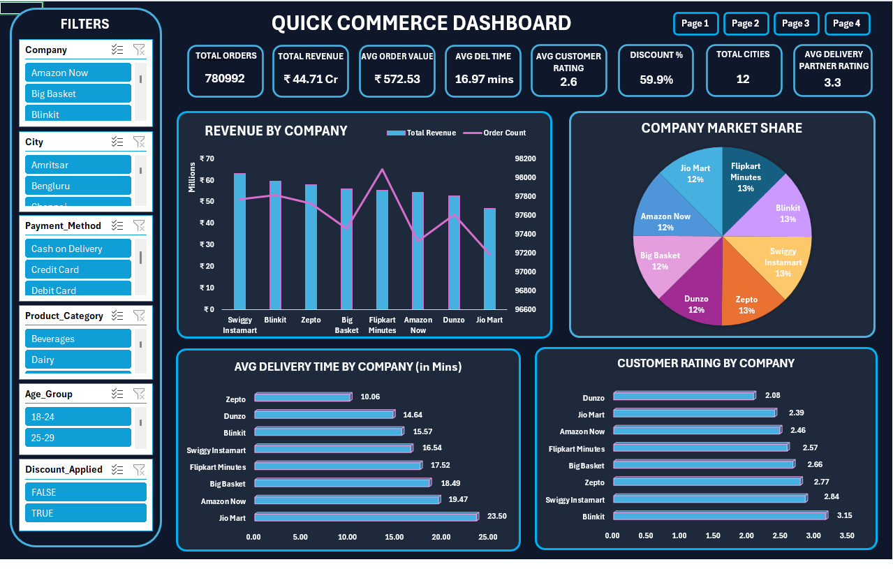
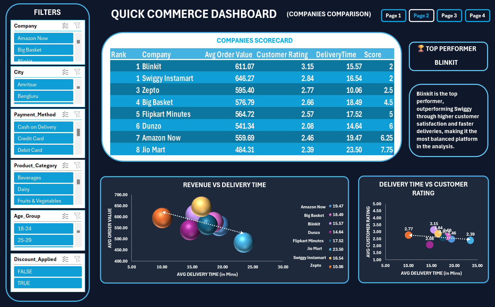
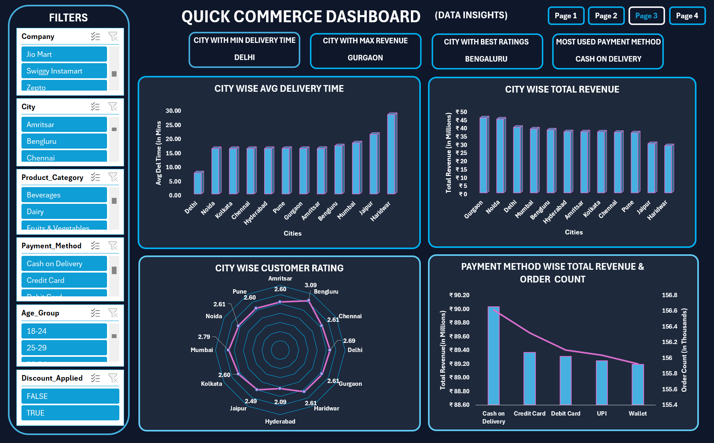
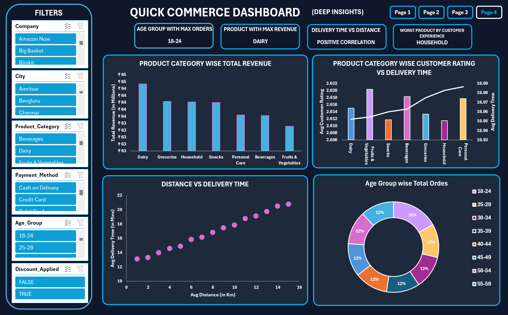

# Quick Commerce Analytics Dashboard

## 📌 Project Overview

This project presents an interactive Excel-based Business Intelligence dashboard built using a large-scale Quick Commerce dataset containing over 1 million transaction records. The objective of the project is to analyze company performance, customer behavior, operational efficiency, and business trends across leading quick commerce platforms.

The dashboard was developed entirely in Microsoft Excel using Power Query, Pivot Tables, Pivot Charts, Slicers, KPI Cards, and advanced data visualization techniques to transform raw transactional data into meaningful business insights.

---

## 🎯 Project Objectives

* Compare the performance of major quick commerce companies.
* Analyze customer purchasing behavior and spending patterns.
* Evaluate delivery efficiency and customer satisfaction.
* Measure the impact of discounts on business performance.
* Identify city-level trends and revenue opportunities.
* Create an interactive dashboard for business decision-making.

---

## 🛠️ Data Cleaning & Transformation

Data preparation was performed using **Power Query** to ensure data quality and consistency before analysis.

### Cleaning Steps Performed

* Removed rows containing null values in the **City** column.
* Removed rows containing null values in the **Items Count** column.
* Rounded **Order Value** to improve reporting consistency.
* Rounded **Delivery Time** values.
* Rounded **Distance** values.
* Rounded **Customer Rating** values.
* Rounded **Delivery Partner Rating** values.
* Converted the **Discount Applied** field into a Boolean (True/False) format.
* Created an **Age Group** column to enable demographic analysis.

---

## 📊 Dashboard Structure

### Page 1 – Executive Dashboard

Provides a high-level overview of business performance through key performance indicators and company comparisons.

#### Key Metrics

* Total Revenue
* Total Orders
* Average Order Value
* Average Delivery Time
* Average Customer Rating
* Discount Utilization Rate
* Total Cities Served

#### Key Insights

* Revenue distribution across companies
* Market share analysis
* Delivery performance comparison
* Customer satisfaction comparison
  

---

### Page 2 – Company Analysis

Focuses on benchmarking and comparing quick commerce platforms.

#### Key Visualizations

* Company Performance Index
* Revenue Comparison
* Customer Spending vs Delivery Efficiency
* Discount Effectiveness Analysis
* Company Scorecard Ranking

#### Key Insights

* Identification of the best-performing company
* Relationship between delivery speed and customer spending
* Operational efficiency evaluation
* Competitive performance analysis

---

### Page 3 – Customer Insights

Analyzes customer behavior and purchasing patterns.

#### Key Visualizations

* Customer Spending by Age Group
* Payment Method Preferences
* Discount Utilization Analysis
* Customer Satisfaction Trends

#### Key Insights

* Most valuable customer demographics
* Preferred payment methods
* Spending behavior patterns
* Customer engagement analysis

---

### Page 4 – City Analysis

Explores geographical performance and operational trends.

#### Key Visualizations

* Revenue Contribution by City
* Delivery Performance Across Cities
* Customer Satisfaction by City

#### Key Insights

* Top revenue-generating cities
* Cities with fastest deliveries
* Regional customer satisfaction trends
* Growth opportunities across locations

---

## 🏆 Key Findings

* Blinkit emerged as the top-performing company due to superior customer ratings and delivery efficiency.
* Faster delivery times generally correlated with higher customer satisfaction.
* Discounted orders demonstrated higher average order values.
* Customer spending patterns varied significantly across age groups.
* Revenue contribution was concentrated within a few high-performing cities.

---

## 📈 Tools & Technologies Used

* Microsoft Excel
* Power Query
* Pivot Tables
* Pivot Charts
* Slicers
* Conditional Formatting
* KPI Cards
* Camera Tool
* Data Visualization Techniques

---

## 🚀 Outcome

This project demonstrates the complete analytics workflow from data cleaning and transformation to dashboard development and business insight generation. It highlights the use of Excel as a powerful Business Intelligence tool for analyzing large-scale operational and customer datasets.
